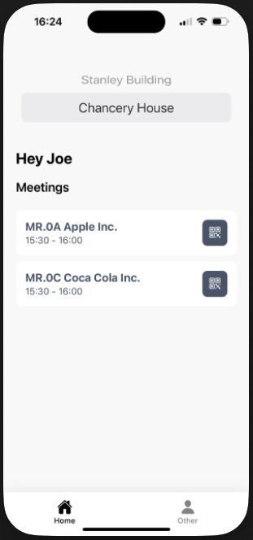

## 🖼️ Preview



# 🏗️ Fora React Native App

This is a React Native app built with **Expo**, using **TypeScript**. It is a mobile app that allows you to change your workplace using a picker, it will then dynamically change the meeting data based on your workplace/building ID.

---

# Struggling getting the app and running

no worries, I have attached a screenshot to see what it looks like from the home screen. We can then run it in our call.

### 🛠 Installing & Running the App

1. **Clone the project**

```bash
git clone git@github.com:naldo1026/fora-react-native.git
cd fora-react-native

npm install

npx expo start
```
